  

  

  

 

<strong>AQUA LAUNCH</strong> · animated profile system · powered by live GitHub data

---

### Deploy this style

Follow [SETUP.md](./SETUP.md) to replace the photo, animate your own name, connect your GitHub data, and enable automatic daily updates.
